# 1.串行通用矩阵乘法及其优化

串行通用矩阵乘法的实现是使用一个三重循环（矩阵 $A(M*N)$ 和矩阵 $B(N*K)$ 进行矩阵乘法得到矩阵 $C(M*K)$）具体实现可见`对比分析.pdf`。

- 优化：

  - 切换循环顺序：由于在实现通用矩阵乘法时会不自觉地使用**<u>列主序</u>**（如上述代码中访问$B[j][k]$），而在 C/C++ 中是<u>**行主序**</u>，因此使用<u>**列主序**</u>会导致无法很好地使用空间局部性，因此可以交换第二层和最内层的循环，使得在保证结果正确性的前提下，矩阵$A$、$B$、$C$ 均按照<u>**行主序**</u>进行访问，具体实现可见`对比分析.pdf`。

  - 循环展开：在每次循环迭代中，循环控制变量（$i$、$j$、$k$）需要更新和检查是否满足终止条件，这些操作在汇编级别上会转化成多条指令如加法、比较和跳转指令。而通过循环展开，可以减少这些控制指令的执行次数，优化后的代码如下（假设展开的步长为 $stride$）具体实现可见`对比分析.pdf`。
  
  - 在编译时使用编译优化，编译优化等级及简要说明如下：
  
    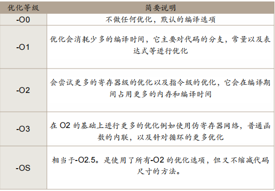 
  
  - 使用一些其他的库如Intel MKL的API`cblas_dgemm`，来加速串行矩阵乘法（需要自行配置好环境并导入头文件`mkl.h`）。

# 2.基于分布式内存的并行编程框架的矩阵乘法($\mathbf{MPI}$)

- 任务分配：MPI通过将矩阵乘法任务分发给每个进程、每个进程完成任务后将矩阵乘法结果汇总到指定的一个进程(一般是0号进程)，这里只是进行一个概述，详细的任务分配和通信部分结合在一起介绍。

- 通信：MPI有点对点通信和集合通信两种方式，在使用MPI之前，同样需要导入头文件`mpi.h`，然后在使用MPI执行并行任务之前必须要先进行MPI初始化，在最后任务结束时必须结束MPI。

  初始化和结束所需的API的介绍如下：
  
   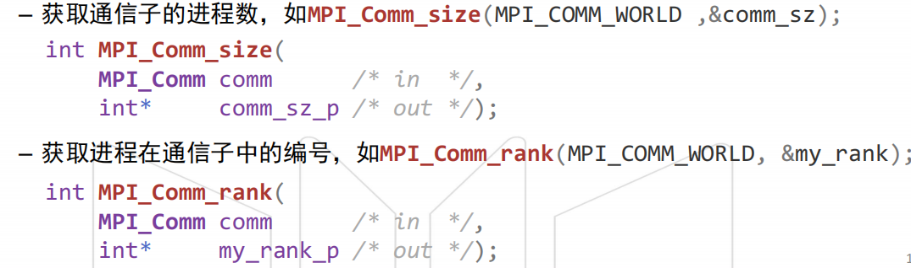
  
  接下来介绍一下点对点通信和集合通信的区别：
  
  - 点对点通信：

    - 需要指明发送信息：位置、大小、类型、标志tag(用于区分相同发送方与接收方之间的多条信息)

    - 需要指明接收方信息：编号、通信子、标志tag(用于区分相同发送方与接收方之间的多条信息)

    - 最基础的两个API：`MPI_Send`(发送信息)、`MPI_Recv`(接收信息)。（除此之外还有`MPI_Ssend`、`MPI_Sendrecv`等API，但基本上是根据`MPI_Send`和`MPI_Recv`的原理进行实现的）

      2个API的介绍如下：

      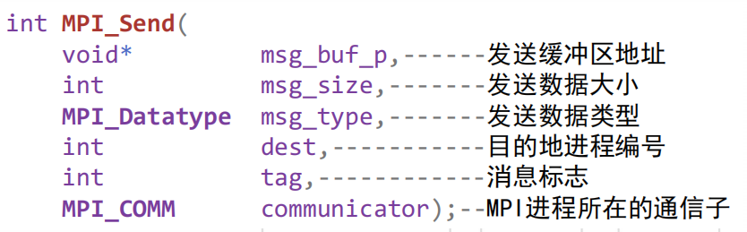 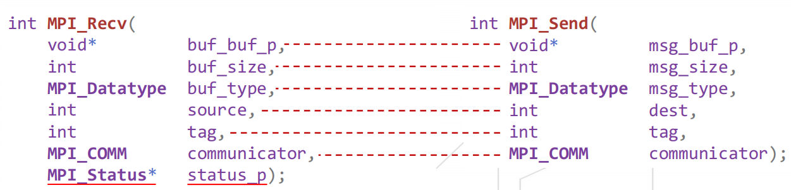

    - 对于矩阵乘法任务，可以根据可并行的进程数$\mathbf{process\_num}$，对矩阵$A$进行划分，每个进程划分$\frac{M}{\mathbf{process\_num}}$行，由0号进程将其他进程对应的矩阵$A$的块和矩阵$B$发送出去，其他进程则要接收0号进程发送过来的矩阵$A$的分块和矩阵$B$，然后在进程内进行矩阵$A$的分块和矩阵$B$的串行矩阵乘法，最后其他进程将计算结果发送给0号进程。需要注意的是，$i$号进程计算的是矩阵$A$的$(i-1)\times\frac{M}{\mathbf{process\_num}}$行到$i\times\frac{M}{\mathbf{process\_num}}$行（左开右闭）和矩阵$B$的结果，因此矩阵$A$还剩余$M-(\mathbf{process\_num}-1)\times\frac{M}{\mathbf{process\_num}}$行没有计算，这部分可以放在0号进程里进行计算。具体实现可见`对比分析.pdf`。

  - 集合通信：

    - 通信子中所有进程共同参与的通信

    - 需要对常见的通信模式与运算进行抽象

    - 常用API：`MPI_Bcast`(广播)、`MPI_Scatter`(散射)、`MPI_Gather`(汇总)、`MPI_Reduce`(规约)、`MPI_Allreduce`(全局规约)、`MPI_Allgather`(全局聚集)，上述API的介绍如下：

      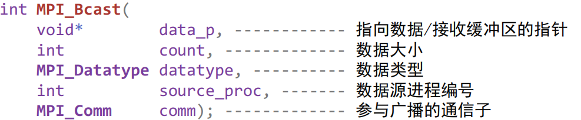 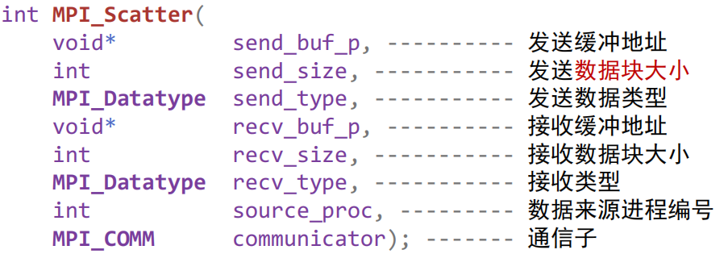
  
      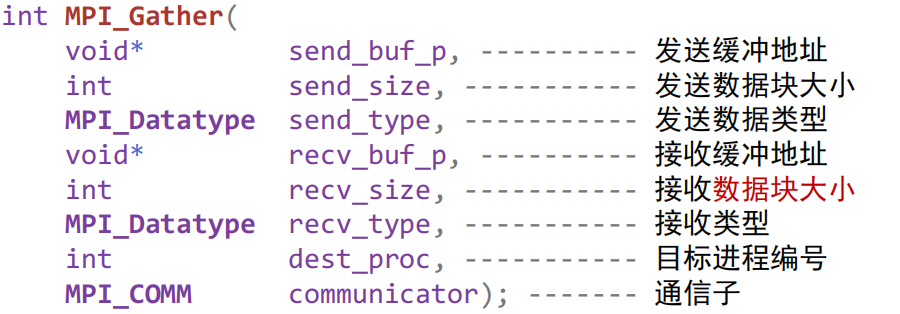 
  
      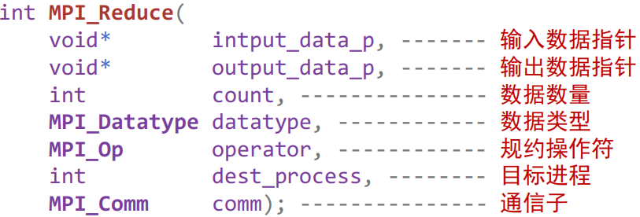 
  
      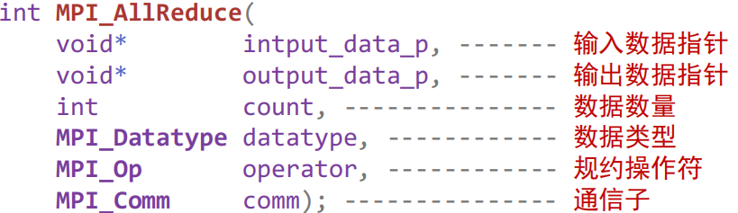 
  
      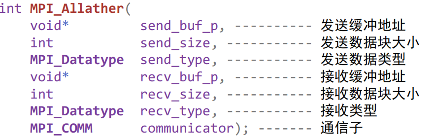 
  
      (上述`MPI_Allather`应为`MPI_Allgather`)
  
      `MPI_Reduce`、`MPI_Bcast`、`MPI_Gather`、`MPI_Scatter`、`MPI_Allgather`的效果如下：
  
      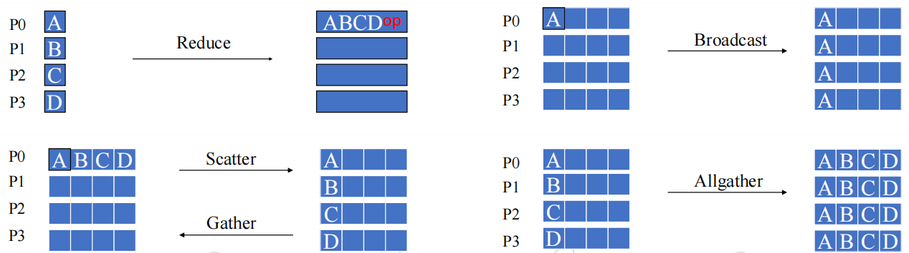 
  
      除此之外，可以将数据进行打包：
  
      ①使用`MPI_Type_create_struct`创建一个新的MPI数据类型，需要使用`MPI_Type_commit`启用创建好的新的MPI数据类型，使用完需要使用`MPI_Type_free`释放为该类型分配的相关资源。
  
      ②使用`MPI_Type_contiguous`将多个相同类型元素组成的连续数据类型，同样需要使用`MPI_Type_commit`启用创建好的新的MPI数据类型，使用完需要使用`MPI_Type_free`释放为该类型分配的相关资源。
  
      ③使用`MPI_Type_vector`将多个相同类型向量组成的向量数据类型。
  
      ④使用`MPI_Type_indexed`将多个相同类型数据块组成的索引数据类型。
  
      ⑤使用`MPI_Pack`对数据进行打包，再使用`MPI_Unpack`对打包好的数据进行解包。
  
    - 对于矩阵乘法任务，同样根据可并行的进程数$\mathbf{process\_num}$，对矩阵$A$进行划分，每个进程划分$\frac{M}{\mathbf{process\_num}}$行。使用`MPI_Bcast`将矩阵$B$广播到各个进程，使用`MPI_Scatter`将矩阵$A$分发给各个进程。接着各个进程将计算后的结果使用`MPI_Gather`汇总到0号进程。具体实现可见`对比分析.pdf`。
  
- 同步：在MPI中使用`MPI_Barrier`来同步通信子<u>**进程**</u>，只有通信子中进程全部调用`MPI_Barrier`后，函数调用才返回。

# 3.基于共享内存的CPU多线程编程($\mathbf{Pthread}$)

- 任务分配：与MPI不同，$\mathbf{Pthreads}$是将矩阵乘法任务分配给一个进程里的多个线程，每个线程执行完毕后，使用汇聚操作合并执行结果并释放内存。

  根据可并行的线程数$\mathbf{thread\_num}$，对矩阵$A$进行划分，每个线程负责计算矩阵$A$的$\frac{M}{\mathbf{thread\_num}}$行与矩阵$B$的乘积，将计算结果存储到矩阵$C$的对应位置中。

  具体过程为：

  ①导入头文件`pthread.h`。

  ②定义一个多线程并行矩阵乘法函数，需要注意的是函数的参数类型和返回类型均为`void*`

  ③在`main`函数(进程)中要为各个线程分配空间，然后定义线程号数组(在执行矩阵乘法操作时需要使用线程号来找到指定的行数，线程号实际上是作为并行矩阵乘法函数的形参)：
  
  ④接下来要使用`pthread_create`创建并启动线程，指明其执行内容(`parallel_gemm`函数)，在线程执行完毕之后，使用汇聚操作(`pthread_join`)合并执行结果。
  
  具体实现可见`对比分析.pdf`。
  
- 通信与同步：$\mathbf{pthreads}$的通信主要涉及各个线程之间的竞争，如多个同时对一个共享变量进行写操作或者有2个变量同时分别对一个共享变量进行读和写操作，均会造成竞争现象，因此需要处理好各个线程之间的通信与同步问题，此时可以通过以下几种方式来解决问题（在我上面实现的多线程并行矩阵乘法中不会存在竞争，只存在多个线程对$B$的读操作、不存在同时对矩阵$C$中某个位置的写操作）：

  - 忙等待(`busy waiting`)：

    - 只有一个线程能执行实际运算，其他线程消耗资源进行检查。此种方法可能会导致死锁。

  - 互斥量(`mutex`)：

    - 在任意时刻，只有一个线程可以访问共享资源/临界区，设计两个基本操作加锁(lock)和解锁(unlock)。在访问临界区之前需要尝试加锁，若成功获得锁则进入临界区，否则线程会被阻塞；在访问临界区之后释放锁，系统会唤醒其他线程进入临界区。在使用互斥量之前需要对其进行初始化，使用完毕后需要销毁它。
    - 相较于忙等待，互斥量带来的额外开销更小，但是无法保证执行顺序（随机或由系统调度决定），不过某些应用控制保证访问临界区的顺序（生产者-消费者）。

  - 信号量(`semaphore`)：

    - 需要导入头文件`semaphore.h`。
    - 需要对信号量进行初始化(`init`)，其表示可用的资源数量，如使用其实现互斥锁时信号量赋值为1，除此之外还会涉及到发送信号量(`post`)、等待(`wait`)和销毁(`destroy`)等操作。

  - 路障(`Barrier`)：

    - 可以使用一个共享计数器，统计到达路障的线程数量(共享计数变量的更新需要使用`mutex`来维护，需要使用忙等待检查状态)。除此之外，也可以使用信号量来实现路障。下图分别为使用互斥锁和信号量实现路障的代码(来自课件)：

      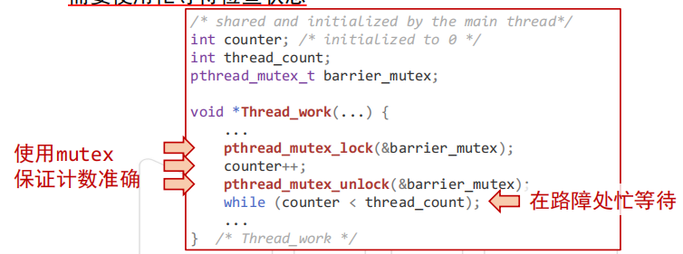 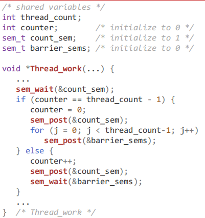

    - $\mathbf{pthreads}$中已提供路障实现，且可以控制等待线程数量：

      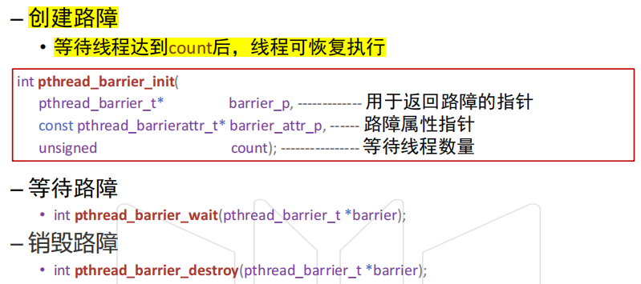 

  - 条件变量(`conditional variables`)：

    - 数据对象，允许特定条件或事件发生前挂起线程， 条件或事件发生时，由另一个线程唤醒被阻塞的线程。

    - 总是与互斥量（mutex）配合使用。

      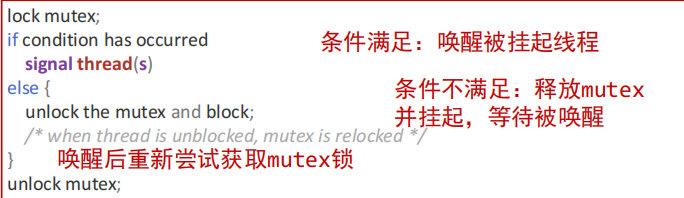 

    - 目的：在条件满足时，执行临界区内的代码。

    - 实现：

      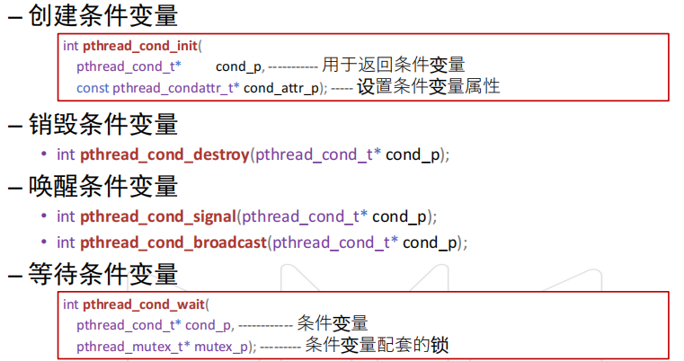 

  - 读写锁(`read-write lock`)：

    - 允许多个线程同时对共享资源进行读操作。

    - 写操作期间需要互斥访问，以确保数据的一致性。

    - 与互斥锁相似，但包含两种锁状态：读锁和写锁。一个线程持有读锁时，其他线程仍然可以获取读锁(允许并发的读取)；一个线程持有写锁时，其他线程必须等待该写锁的释放；任意线程持有读锁时，其他线程无法获得写锁。

    - 基本操作：

      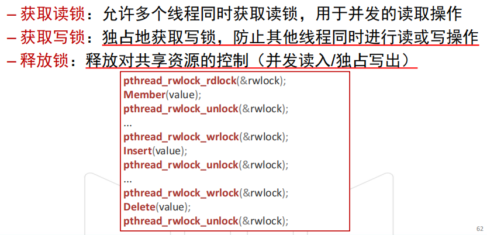 

    - 需要执行的操作：

      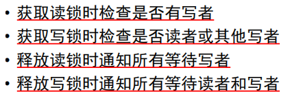 

  - 除此之外，还需要考虑缓存一致性和伪共享问题以及线程安全性问题(C中使用静态变量的库函数是非线程安全的)。

# 4.GPU多线程编程 $\mathbf{CUDA}$

- 任务分配：在CUDA中，通过设置线程块的大小和维度，然后根据问题规模来确定网格数量和维度，此处的网格大小表示的是在一个维度上需要多少个线程块来覆盖所有的线程，线程块的大小表示每个块内包含的线程数量。

  GPU架构与线程组织如下：

  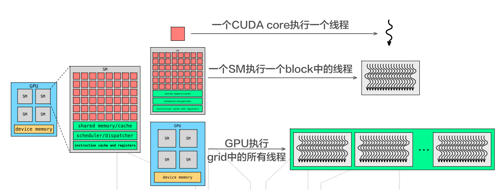 

  在矩阵乘法中，使用二维的线程块，因此网格也有两个维度，需要注意的是CUDA中调用核函数时需要指明线程块和网格的信息(分别使用一个`dim3`类型的变量也即三元组来存储信息)，两个块中的`x`表示的是列方向上的信息、`y`表示的是行方向上的信息。线程块的维度信息为`(blockDim.x,blockDim,y,1)`，网格块的维度信息为`((K+blockDim.x-1)/blockDim.x,(M+blockDim.y-1)/blockDim.y,1)`。

  假设每个线程块内共有$\mathbf{threads\_per\_block}$个线程，`blockDim.x`和`blockDim.y`的乘积应为$\mathbf{threads\_per\_block}$，当`blockDim.y=1`时按行进行划分，`blockDim.x=1`时按列进行划分，`blockDim.x`和`blockDim.y`均不为1时按块进行划分。

  此外CUDA的访存方式分为全局内存和共享内存，使用共享内存时又分为静态和动态共享内存，需要使用`__shared__`关键字声明共享内存，使用动态共享内存时需要在调用核函数时指明动态共享内存的大小。除此之外，使用共享内存时应该注意防止`bank`冲突。

- 通信和同步：CUDA在通信方面要注意的主要是使用共享内存时，同一个线程块内的各个线程使用共享内存时需要注意避免竞争，在共享内存中进行通信时需要使用`__syncthreads()`来避免竞争条件。而块间通信有可能会出现通信上的问题如竞争(当然在矩阵乘法中不会出现)，可以使用原子操作来解决问题。